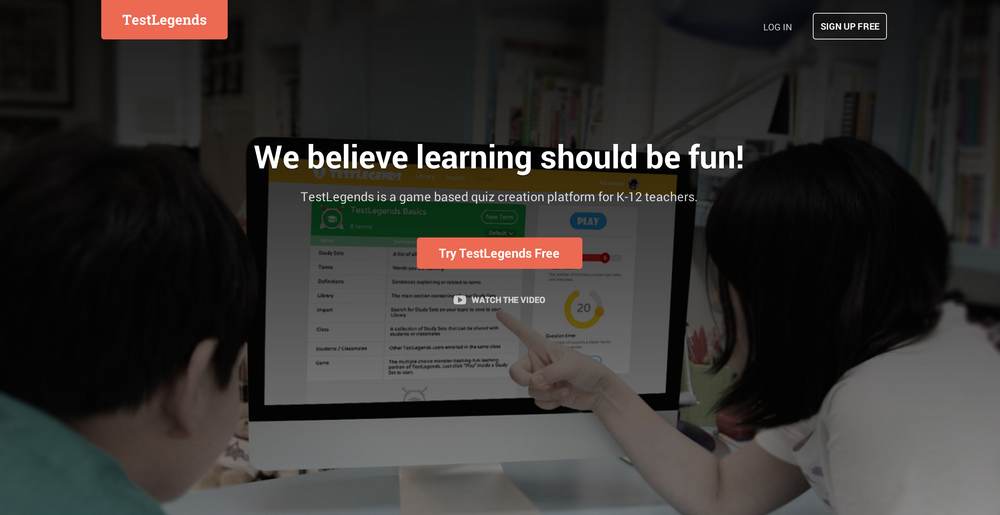
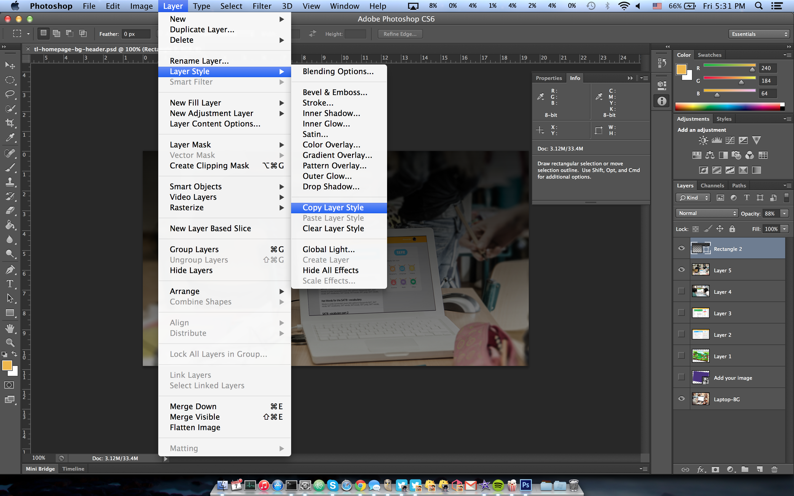
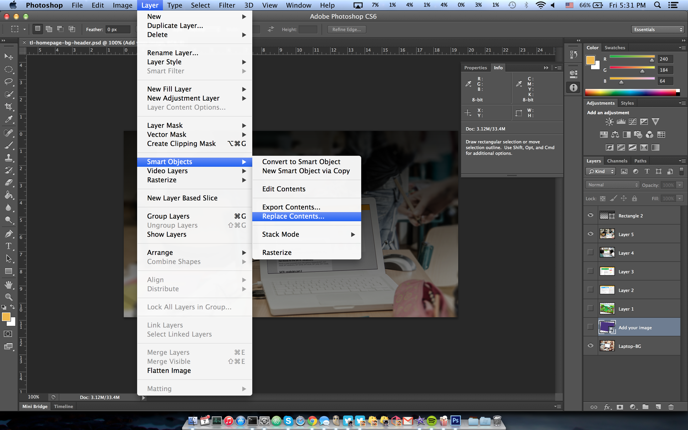
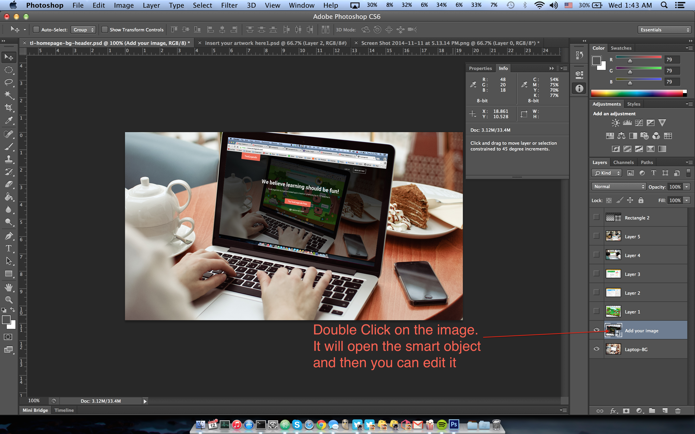
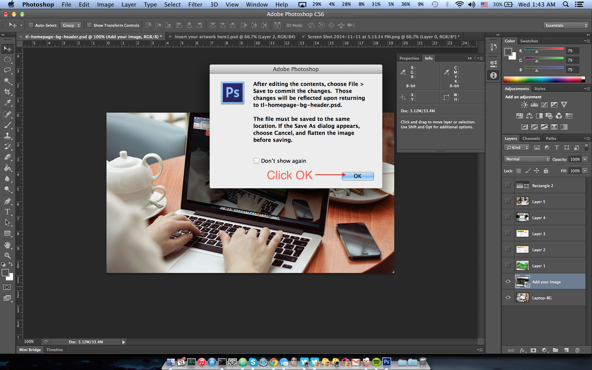
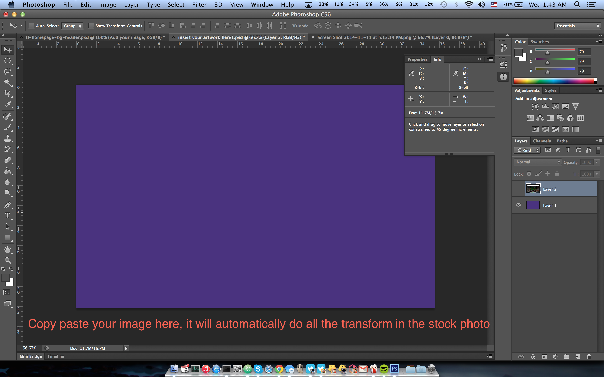

TestLegends Landing
===================

#### Demo:



How to start?
```
npm start
```
It will install everything you need and start the server

#### Little photosohp tricks to change up stock photos
1. Copy layer style


2. Replace smart obj (copy image perspective)


3. Best way to replace image in stock photo



