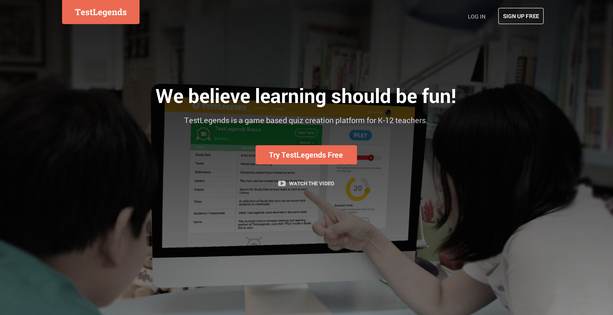
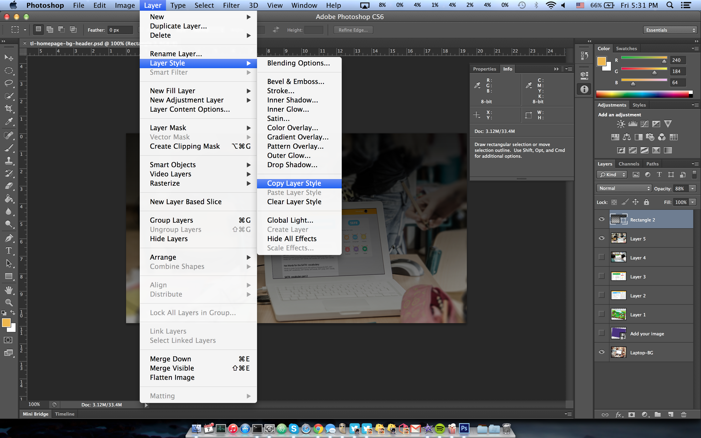
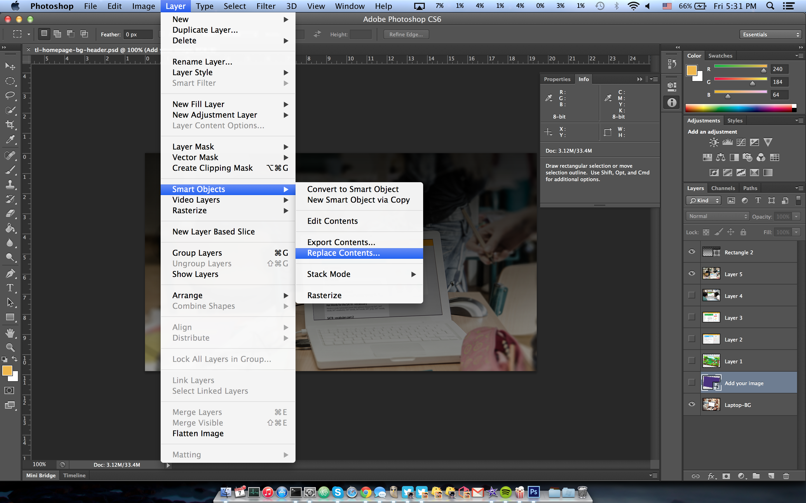

TestLegends Landing
===================

#### Demo:



How to start?
```
npm start
```
It will install everything you need and start the server

#### Little photosohp tricks to change up stock photos
copy layer style


replace smart obj (copy image perspective)

